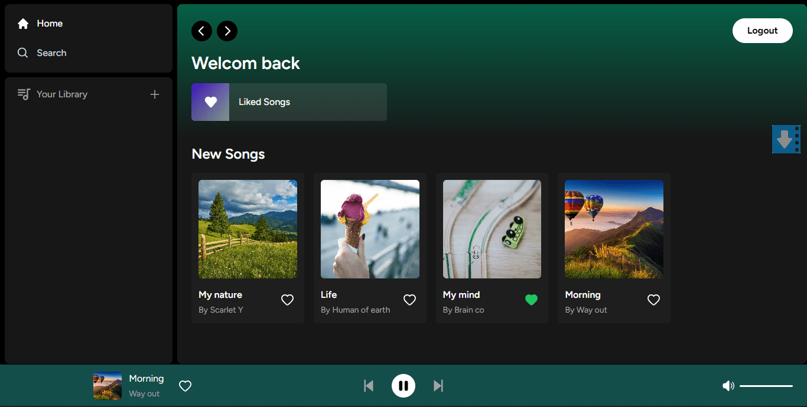
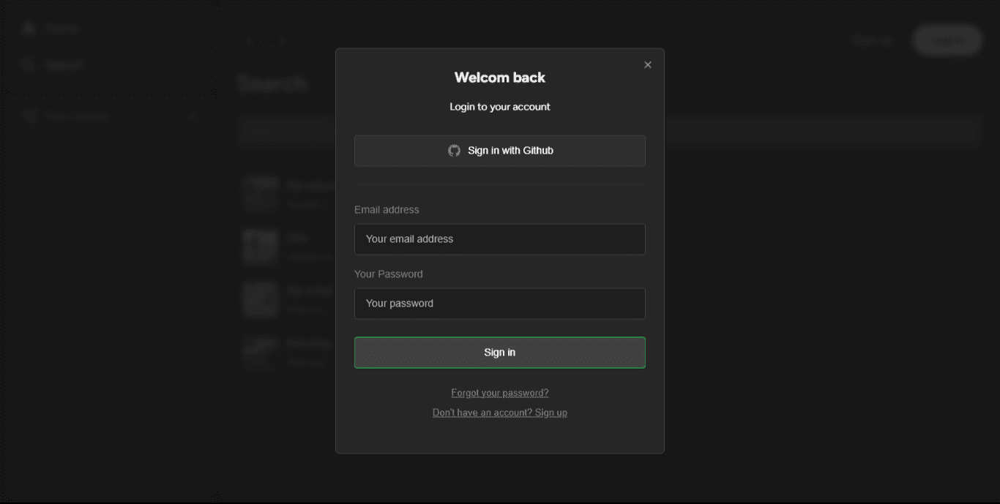
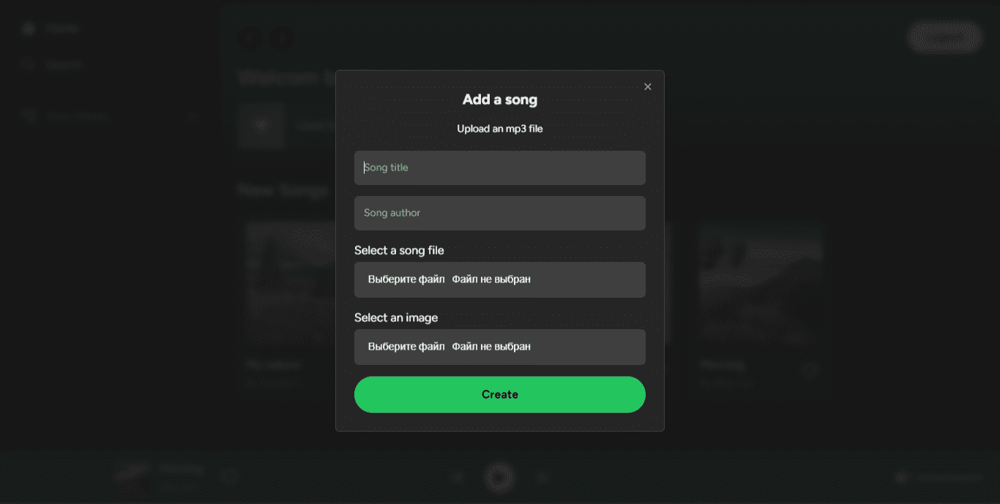
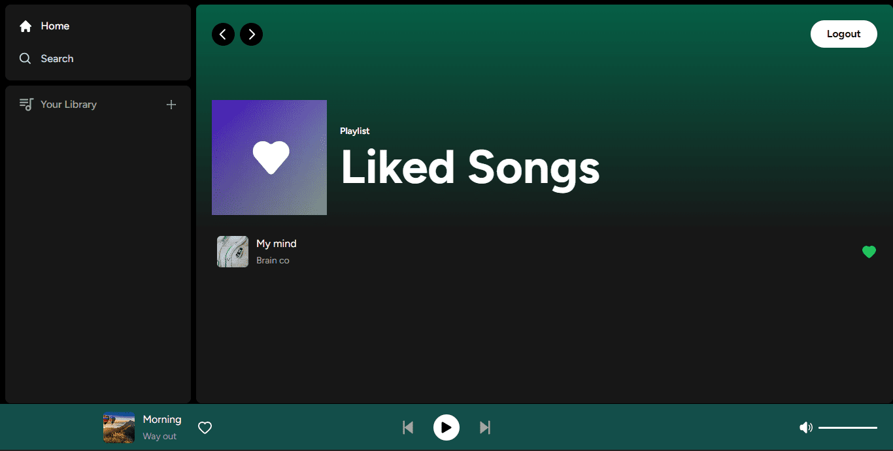
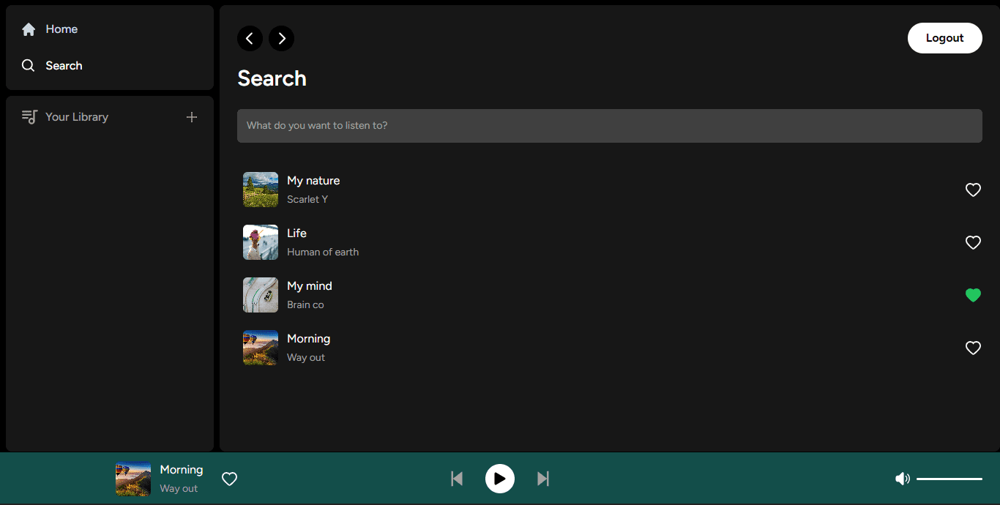

<p align="center">


</p>

<h1 align="center">Web-player</h1>


<h2 align="center"><a target="_blank"  href="https://wep-player.vercel.app/">Live Demo</a></h2>

<br />

<p align="center">
   


</p>

## Description

Web player - online player for playing music

## Authentication

<p align="center">
   


</p>

Authorization takes place using the supabase service

## Add an song

<p align="center">
   


</p>

Songs are uploaded to supabase to be played back in the app.

## Liked songs

<p align="center">
   


</p>

There is also a favorites page where you can launch the player and it will play only the songs you like.

## Search

<p align="center">
   


</p>

And search where you can launch the player, and it will play only the found songs

## About the project

#### Frontend stack: 

- Next.js
- Tailwind
- TypeScript

#### Backend stack: 

- Supabase
- PostgreSQL

## Project setup

```
npm install
npm run start
```
